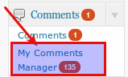
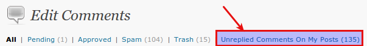
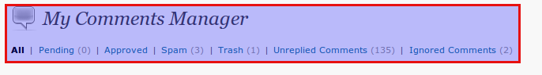
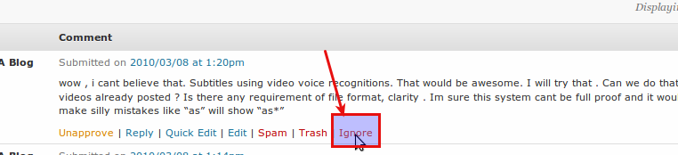

<!-- DO NOT EDIT THIS FILE; it is auto-generated from readme.txt -->
# My Comments Manager

Comments Manager for multi-author blogs, where each author can manage comments posted on his/her articles.

**Contributors:** [rtcamp](https://profiles.wordpress.org/rtcamp)  
**Tags:** [Comments](https://wordpress.org/plugins/tags/Comments), [Comment](https://wordpress.org/plugins/tags/Comment), [multi author](https://wordpress.org/plugins/tags/multi author), [Plugins](https://wordpress.org/plugins/tags/Plugins), [Dashboard](https://wordpress.org/plugins/tags/Dashboard), [Moderation](https://wordpress.org/plugins/tags/Moderation), [Admin](https://wordpress.org/plugins/tags/Admin)  
**Requires at least:** WP 2.9  
**Tested up to:** WPMU 2.9.2  
**Stable tag:** 1.3.7  
**Donate link:** https://www.paypal.com/cgi-bin/webscr?cmd=_s-xclick&hosted_button_id=9488824  

 

## Description ##

This is useful for multi-author blogs where each author can manage comments posted on his/her articles.
S/he can see all comments on one screen to which s/he hasn't replied.

Though it is developed originally for multi-author blog, single-author blog user can also benefit from this as using this plugin will always give you list of unreplied comments on a single screen.

Any comment to which you post a reply, or choose to ignore (see screenshot) will automatically disappear form unreplied comments list.

## Installation ##

1. Download the zip and unzip it.
2. Upload "my-comments-manager" directory into WordPress plugins directory i.e. "wp-content/plugins" (For WPMU: wp-contents/mu-plugins) .
4. Go to "Dashboard >> Plugins" menu and activate "My Comments Manager".
5. You can access My Comments Manager from "Dashboard >> Comments >> My Comments Manager".

That's it ... Have fun!

## Screenshots ##

### My Comments Mangaer Admin Menu

### Link to Unreplied Comments in Edit Comments

### Menu in My Comments Manager

### Ignore button in My Comments Manager

## Does this interest you?

